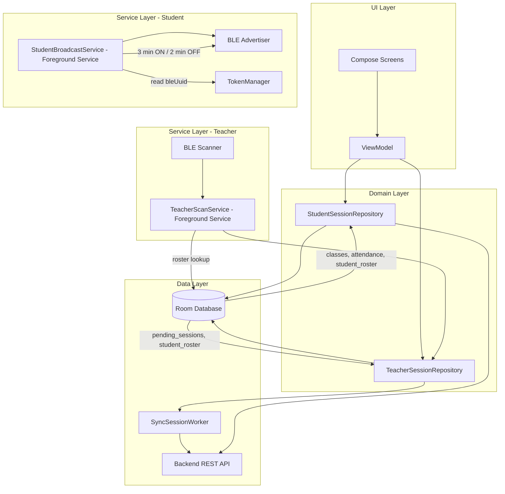

# Attendify — Smart Attendance (Mobile Client)


Attendify is a secure, BLE-driven Android application that automates classroom attendance through a coordinated two-role architecture: teacher devices **scan** for nearby BLE advertisers, and student devices **broadcast** their unique BLE UUID in timed cycles. Presence is determined by cross-referencing detected UUIDs against a locally cached student roster, incrementing a per-student `hit_count` for each detection window. All session data is persisted locally with Room and synced to a decoupled backend server.

---

> **🔗 Backend Repository**
> The server-side API, database schema, and sync endpoints live in a separate repository.
> **→ [attendify-backend](https://github.com/aetherRohan/attendify-backend-server)** — Spring Boot / REST API powering the sync layer.

---

## Key Mobile Features

### 🔵 BLE Scanning Engine — Teacher Side
- Runs **30-second on / 30-second off micro-cycle scans** to detect student BLE advertisers in proximity.
- The BLE scanner uses a **hardware-level `ScanFilter` keyed on the shared service UUID (`0000FFFF-0000-1000-8000-00805F9B34FB`)**, ensuring the BLE chip only wakes the app for advertisements that carry Attendify's service data — unknown devices are filtered in hardware before any software callback fires, minimising battery drain and CPU wake-ups.
- On each detected advertisement, the teacher service looks up the advertised UUID against the locally cached `student_roster` for the active class. Only UUIDs present in the roster are counted — unknown devices are silently discarded.
- For every matched UUID, the `hit_count` for that student is incremented via upsert logic, ensuring a student must be detected across multiple scan windows to be reliably marked present. This materially reduces false positives from transient Bluetooth proximity.
- Handles BLE state changes (adapter off, permissions revoked) gracefully without crashing the service.

### 📡 BLE Broadcast Engine — Student Side
- `StudentBroadcastService` runs as a persistent **foreground service** that advertises the student's unique BLE UUID — issued by the backend at login and stored securely via `TokenManager` — so that teacher devices can detect their presence.
- Operates on a **3-minute broadcast / 2-minute silence** duty cycle. Broadcasting continuously would drain the battery and generate redundant hits; the silence window gives the device time to cool while a single detected window per cycle is sufficient for the hit-count model.
- The BLE advertiser is configured with `ADVERTISE_MODE_LOW_LATENCY` during active windows and stopped cleanly during the silence gap, restarting on a `Handler`-posted callback to avoid coroutine overhead in a service that does no I/O.
- Service lifecycle is tied to the student's enrolled session: it self-terminates if the student is not actively enrolled in any class, or on an explicit stop command from the ViewModel.
- Broadcast UUID is sourced from `TokenManager.getBleUuId()` at service start. If the UUID is missing (e.g. the session was cleared), the service exits immediately rather than broadcasting a null identifier.

### ⚙️ Foreground Service Lifecycle
- `TeacherScanService` runs as a persistent **foreground service** with a sticky notification, surviving app backgrounding and screen-off states.
- `StudentBroadcastService` mirrors the same lifecycle contract — persistent, sticky notification, self-terminating on session end.
- Service binding is managed carefully to avoid `lateinit var` initialization errors on rebind — the binder checks service readiness before exposing the interface.

### 🗄️ Local Database Caching (Room)

Five-table schema backing both the teacher and student flows:

| Table | Purpose |
|---|---|
| `classes` | Cached class metadata synced from the backend. |
| `class_sessions` | Per-class session records (one row per conducted session). |
| `attendance` | Per-student attendance outcome keyed on `(classSessionId, studentId)`. |
| `student_roster` | BLE UUID ↔ student identity map, keyed on `(studentId, classId)`. Used by the teacher scanner for hit-count attribution. |
| `pending_sessions` | Teacher-side sessions awaiting backend sync, holding the raw `studentHitsMap`. |

All DAO operations return `Flow<T>`, enabling reactive UI updates without polling. Upsert logic (`OnConflictStrategy.REPLACE`) ensures `hit_count` increments are idempotent.

### 🔄 Data Sync Strategy
- **Offline-first**: all attendance data is written locally before any network operation.
- `SyncSessionWorker` (WorkManager `CoroutineWorker`) periodically flushes `pending_sessions` to the backend REST API. It retries on 5xx server errors and gives up permanently on 4xx client errors, capping total attempts at `MAX_RETRIES = 3` to avoid hammering a downed server.
- Student-side sync (`StudentSessionRepository`) eagerly refreshes the class list and attendance history from the backend on launch, keeping the local cache fresh for offline reads.
- Sync status is reflected in the UI via ViewModel-observed state; failed syncs are retried on the next cycle without data loss.

### 🔐 Token & Security Layer
- Access tokens are encrypted at rest with **AES-256-GCM** via Google Tink, backed by the Android Keystore (`attendify_master_key`). Raw tokens are never written to DataStore.
- `TokenAuthenticator` (OkHttp `Authenticator`) silently refreshes the access token on 401 responses using the stored refresh token, retrying the original request transparently. After three consecutive refresh failures the session is forcibly cleared and the user is redirected to `MainActivity`.
- Student BLE UUID is stored alongside user metadata in the same encrypted DataStore and retrieved synchronously only within the broadcast service's startup path.

---

## BLE Duty Cycle — How the Two Sides Coordinate

```
Student Device                        Teacher Device
──────────────────────────────────    ──────────────────────────────────
T+0:00  START broadcast (3 min)  ───► Scan ON (30 sec): service UUID hardware filter active
         UUID: "stu-xxxx-..."          Roster lookup: O(1) HashMap
                                       hit_count[studentId]++
                                ·····  Scan OFF (30 sec)
                                ·····  Scan ON (30 sec) → hit_count[studentId]++
                                ·····  Scan OFF (30 sec)
                                ·····  ... (30/30 cycles repeat within the 3 min window)
T+3:00  STOP broadcast (2 min)
                                ·····  Scan cycles continue; no matching hits during silence
T+5:00  START broadcast (3 min)  ───► Scan ON resumes → hit_count[studentId]++
         ...                           ...
```

The teacher's 30-second on / 30-second off scan cycle runs continuously across the student's 3+2 duty cycle. The student's 3-minute broadcast window guarantees multiple teacher scan-on windows catch at least one advertisement, even with minor clock drift. A student detected during any scan-on window within a teacher cycle accumulates hits; the presence threshold (minimum hits required to be marked present) is configured server-side and evaluated during the sync step.

---

## Mobile Architecture



> **Pattern:** Single-activity, MVVM. The `Repository` is the single source of truth — the ViewModel never talks to the DAO or the network directly. Both `TeacherScanService` and `StudentBroadcastService` interact with the domain layer exclusively through their respective repositories.

---

## Project Structure

```
com.rohan.attendify_smart_attendance
├── data/                       # Data Layer: Implementations and external data sources
│   ├── ble/                    # Bluetooth Low Energy hardware abstractions (Scan/Broadcast)
│   ├── local/                  # Room Database: DAOs, Entities, and TypeConverters for offline caching
│   └── remote/                 # Network: Retrofit APIs and DTOs (Data Transfer Objects)
├── domain/                     # Domain Layer: Core business logic 
│   ├── repository/             # Contracts (Interfaces) defining data operations
│   └── session/                # Use cases and controllers managing attendance business rules
├── security/                   # Cryptography, secure token storage, and authentication interceptors
├── service/                    # Android Foreground Services managing OS-level BLE lifecycles
├── ui/                         # UI Layer: Jetpack Compose screens, ViewModels, and state management
├── utils/                      # Extension functions, constants, and global helper utilities
├── worker/                     # WorkManager definitions for guaranteed background data synchronization
```

---

## Prerequisites

| Requirement | Version / Detail |
|---|---|
| Android Studio | Hedgehog `2023.1.1` or newer |
| JDK | 17+ |
| Kotlin | `2.0.21` |
| KSP | `2.0.21-1.0.28` |
| Room | `2.6.1` |
| Min SDK | `26` (Android 8.0) |
| Target SDK | `35` |
| Build Tools | `35.0.0` |

### Required Hardware
- A physical Android device is **mandatory** for both roles. The emulator supports neither BLE scanning nor BLE advertising.

### Runtime Permissions

| Permission | Android Version | Purpose |
|---|---|---|
| `BLUETOOTH_SCAN` | 12+ (API 31+) | Scan for nearby BLE advertisers — teacher devices |
| `BLUETOOTH_ADVERTISE` | 12+ (API 31+) | Broadcast BLE UUID — student devices |
| `BLUETOOTH_CONNECT` | 12+ (API 31+) | BLE adapter management |
| `BLUETOOTH_ADMIN` | < API 31 | Legacy BLE control |
| `ACCESS_FINE_LOCATION` | All | Required by Android for BLE scanning |
| `FOREGROUND_SERVICE` | All | Run `TeacherScanService` / `StudentBroadcastService` |
| `FOREGROUND_SERVICE_CONNECTED_DEVICE` | 14+ (API 34+) | Foreground service type for BLE operations |

> ⚠️ **Android 12+ Note:** `BLUETOOTH_SCAN`, `BLUETOOTH_CONNECT`, and `BLUETOOTH_ADVERTISE` are **runtime permissions** and must be requested explicitly. Do not assume they are granted on app launch. Student devices additionally require `BLUETOOTH_ADVERTISE` — omitting this manifest entry will silently prevent advertising from starting on API 31+.

---

## Local Setup & Installation

### 1. Clone the Repository

```bash
git clone https://github.com/your-org/attendify-mobile.git
cd attendify-mobile
```

### 2. Configure the Backend URL

Create or edit `local.properties` in the project root and add your backend base URL:

```properties
# local.properties
BACKEND_BASE_URL="http://YOUR_SERVER_IP:PORT/"
```

> If running the backend locally, replace `YOUR_SERVER_IP` with your machine's local network IP (e.g., `192.168.1.5`). `localhost` will **not** work from a physical device.

### 3. Build & Run

**Debug build via Gradle wrapper:**

```bash
./gradlew assembleDebug
```

**Install directly to a connected device:**

```bash
./gradlew installDebug
```

**Run all unit tests:**

```bash
./gradlew test
```

**Run instrumented tests (requires connected device):**

```bash
./gradlew connectedAndroidTest
```

**Clean build artifacts:**

```bash
./gradlew clean
```

---

## Known Limitations & Roadmap
- [ ] **iOS client** — both BLE scanning and advertising logic are Android-only; a cross-platform client is not planned at this stage.
- [ ] **Sync conflict resolution** — currently last-write-wins; a proper conflict resolution strategy is planned.
- [ ] **Adaptive broadcast power** — `StudentBroadcastService` currently uses a fixed TX power; dynamic adjustment based on classroom size is a future consideration.
- [ ] **Hit-count threshold configuration** — the minimum `hit_count` required for a present mark is currently evaluated server-side; surfacing this as a teacher-configurable parameter per class is planned.

---