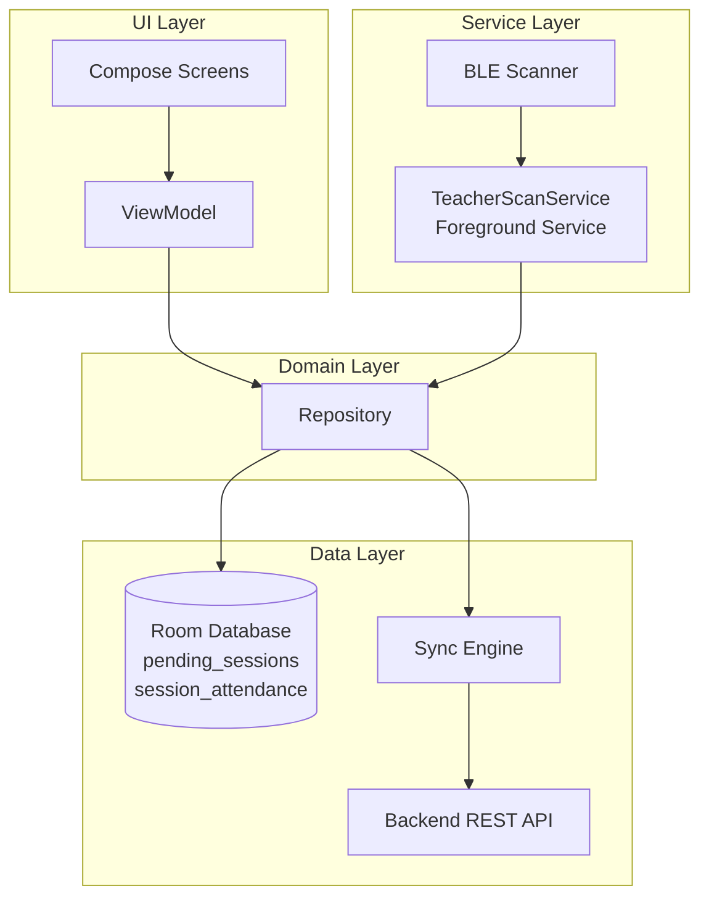

# Attendify — Smart Attendance (Mobile Client)


Attendify is a secure, BLE-driven Android application that automates classroom attendance by detecting student devices via Bluetooth Low Energy micro-cycle scanning. It operates through a foreground service, persists session data locally with Room, and syncs records to a decoupled backend server.

---

> **🔗 Backend Repository**
> The server-side API, database schema, and sync endpoints live in a separate repository.
> **→ [attendify-backend](https://github.com/your-org/attendify-backend)** — Node.js / REST API powering the sync layer.

---

## Key Mobile Features

### 🔵 BLE Scanning Engine
- Runs **5-minute micro-cycle scans** to detect student devices in proximity.
- Tracks `hit_count` per student per session using upsert logic — a student must be detected across multiple cycles to be marked present, reducing false positives.
- Handles BLE state changes (adapter off, permissions revoked) gracefully without crashing the service.

### ⚙️ Foreground Service Lifecycle
- `TeacherScanService` runs as a persistent **foreground service** with a sticky notification, surviving app backgrounding and screen-off states.
- Service binding is managed carefully to avoid `lateinit var` initialization errors on rebind — the binder checks service readiness before exposing the interface.
- Lifecycle is tied to the teacher's active session; the service self-terminates on session end or explicit stop.

### 🗄️ Local Database Caching (Room)
- Two-table schema:
    - `pending_sessions` — stores session metadata awaiting sync confirmation.
    - `session_attendance` — stores per-student attendance records with `hit_count` and presence status.
- All DAO operations return `Flow<T>`, enabling reactive UI updates without polling.
- Upsert logic (`OnConflictStrategy.REPLACE`) ensures `hit_count` increments are idempotent.

### 🔄 Data Sync Strategy
- Offline-first: all attendance data is written locally before any network operation.
- A sync engine periodically flushes `pending_sessions` to the backend REST API.
- Sync status is reflected in the UI via ViewModel-observed state; failed syncs are retried on the next cycle without data loss.

---

## Mobile Architecture



> **Pattern:** Single-activity, MVVM. The `Repository` is the single source of truth — the ViewModel never talks to the DAO or the network directly. The `TeacherScanService` writes scan results through the Repository, so the UI reacts to DB changes via `Flow`.

---

## Project Structure

```
com.rohan.attendify_smart_attendance
├── data/
│   ├── local/
│   │   ├── dao/              # Room DAOs (AttendanceDao, SessionDao)
│   │   ├── entity/           # Room entities (AttendanceEntity, SessionEntity)
│   │   └── AppDatabase.kt    # RoomDatabase singleton
│   ├── repository/           # Repository implementations
│   └── sync/                 # Sync engine & API service
├── service/
│   └── TeacherScanService.kt # BLE foreground service
├── ui/
│   ├── screens/              # Jetpack Compose screens
│   └── viewmodel/            # ViewModels
└── util/                     # BLE helpers, constants
```

---

## Prerequisites

| Requirement | Version / Detail |
|---|---|
| Android Studio | Hedgehog `2023.1.1` or newer |
| JDK | 17+ |
| Kotlin | `2.0.21` |
| KSP | `2.0.21-1.0.28` |
| Room | `2.6.1` |
| Min SDK | `26` (Android 8.0) |
| Target SDK | `35` |
| Build Tools | `35.0.0` |

### Required Hardware
- A physical Android device is **mandatory** for BLE scanning. The emulator does not support Bluetooth hardware.

### Runtime Permissions

| Permission | Android Version | Purpose |
|---|---|---|
| `BLUETOOTH_SCAN` | 12+ (API 31+) | Scan for nearby BLE devices |
| `BLUETOOTH_CONNECT` | 12+ (API 31+) | Connect to BLE devices |
| `BLUETOOTH_ADMIN` | < API 31 | Legacy BLE control |
| `ACCESS_FINE_LOCATION` | All | Required by Android for BLE scanning |
| `FOREGROUND_SERVICE` | All | Run `TeacherScanService` |
| `FOREGROUND_SERVICE_CONNECTED_DEVICE` | 14+ (API 34+) | Foreground service type for BLE |

> ⚠️ **Android 12+ Note:** `BLUETOOTH_SCAN` and `BLUETOOTH_CONNECT` are **runtime permissions** and must be requested explicitly. Do not assume they are granted on app launch.

---

## Local Setup & Installation

### 1. Clone the Repository

```bash
git clone https://github.com/your-org/attendify-mobile.git
cd attendify-mobile
```

### 2. Configure the Backend URL

Create or edit `local.properties` in the project root and add your backend base URL:

```properties
# local.properties
BACKEND_BASE_URL="http://YOUR_SERVER_IP:PORT/"
```

> If running the backend locally, replace `YOUR_SERVER_IP` with your machine's local network IP (e.g., `192.168.1.5`). `localhost` will **not** work from a physical device.

### 3. Build & Run

**Debug build via Gradle wrapper:**

```bash
./gradlew assembleDebug
```

**Install directly to a connected device:**

```bash
./gradlew installDebug
```

**Run all unit tests:**

```bash
./gradlew test
```

**Run instrumented tests (requires connected device):**

```bash
./gradlew connectedAndroidTest
```

**Clean build artifacts:**

```bash
./gradlew clean
```

---

## Known Limitations & Roadmap

- [ ] **Multi-room support** — current schema ties a session to a single room/class.
- [ ] **iOS client** — BLE scanning logic is Android-only; a cross-platform client is not planned at this stage.
- [ ] **Background location requirement** — Android enforces location permission for BLE; future work may explore alternative approaches on API 31+.
- [ ] **Sync conflict resolution** — currently last-write-wins; a proper conflict resolution strategy is planned.

---

## Contributing

This project is under active personal development. Pull requests addressing bugs or items on the roadmap above are welcome.

1. Fork the repository.
2. Create a feature branch: `git checkout -b feature/your-feature`
3. Commit with a clear message and open a PR against `main`.

---

